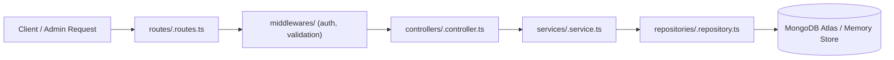

# THUYPD.SITE - Modern Architecture Blueprint & Rules

Tài liệu quy chuẩn kiến trúc hiện đại (Single Source of Truth) áp dụng đồng bộ trên toàn bộ hệ sinh thái **THUYPD.SITE**.

---

## 1. Tổng Quan Hệ Sinh Thái (3 Phân Hệ Độc Lập)

| Phân hệ | Vai trò & Tech Stack | Cấu hình Môi trường (.env) |
|---|---|---|
| `thuypd.site/` | **Client Landing Page** · Next.js 14 (App Router), React 18, TailwindCSS v3, TanStack Query, Framer Motion, Feature-Driven | `NEXT_PUBLIC_SITE_URL`, `BACKEND_API_URL` |
| `api.thuypd.site/` | **Central RESTful API** · Node.js, Express, TypeScript, MongoDB (Mongoose v9), Clean Architecture | `PORT`, `DATABASE_URI`, `JWT_SECRET`, `CLIENT_ORIGINS` |
| `admin.thuypd.site/` | **Admin CMS Portal** · Next.js 14 (App Router), React 18, TailwindCSS v3, shadcn/ui, Feature-Driven | `NEXT_PUBLIC_API_URL`, `BACKEND_API_URL` |

---

## 2. Tiêu Chuẩn Kiến Trúc Frontend (Client & Admin)

Cả `thuypd.site` và `admin.thuypd.site` tuân thủ nguyên tắc **Feature-Driven Architecture (Domain Modularization)**:

### 2.1. Cấu Trúc Thư Mục Feature Chuẩn Mực
Mỗi domain nghiệp vụ (vd: `leads`, `themes`, `landing-config`, `settings`, `pricing`) phải là một module độc lập khép kín nằm trong `features/<domain>/`:

```
features/<domain>/
├── api/          # API clients, endpoints, transformers, mappers của domain
├── components/   # UI components đặc thù của domain
├── hooks/        # Custom hooks, business logic, query mutations
├── types/        # TypeScript interfaces & types riêng của domain (nếu có)
└── index.ts      # Barrel export công khai (Public API) của feature
```

### 2.2. Ranh Giới Phụ Thuộc (Dependency Rules)
1. **Thin Routing Layer:**
   - Trong Next.js (`app/(dashboard)/*`): Mỗi `page.tsx` chỉ đóng vai trò là entry point định tuyến mỏng (~10 dòng code), không chứa inline logic.
   - Ví dụ chuẩn:
     ```tsx
     import { LeadsView } from "@/features/leads";
     export default function LeadsPage() {
       return <LeadsView />;
     }
     ```
2. **Không import chéo giữa các Feature (No Circular Cross-Feature Imports):**
   - Feature A không được import trực tiếp internal components hay hooks của Feature B.
   - Nếu cần chia sẻ dữ liệu/component, tách ra `components/shared/`, `lib/`, hoặc `core/`.
3. **Phân Định Tầng Components Dùng Chung:**
   - `components/ui/`: Chỉ chứa UI primitives nguyên tử (Button, Dialog, Input, Switch, Badge,... từ shadcn / Radix).
   - `components/layout/`: Header, Footer, Sidebar, Navigation Shell.
   - `components/shared/`: Các UI widget dùng chung qua nhiều domain.

---

## 3. Tiêu Chuẩn Kiến Trúc Backend REST API (`api.thuypd.site`)

Backend tuân thủ nghiêm ngặt mô hình **Clean Layered Architecture** 3 lớp:



### 3.1. Trách nhiệm từng tầng (Layer Responsibilities)
1. **Routes (`routes/`):**
   - Khai báo URI paths, HTTP methods (`GET`, `POST`, `PUT`, `PATCH`, `DELETE`).
   - Gắn middlewares (`requireAuth`, `asyncHandler`).
   - Namespace chuẩn: `/api/admin/*` (cần JWT Bearer token) và `/api/client/*` (public).
2. **Controllers (`controllers/`):**
   - Chỉ đảm nhận bóc tách request (params, query, body) và đóng gói response HTTP (`ApiResponse.success`, `ApiResponse.created`, error codes).
   - **Tuyệt đối không chứa logic nghiệp vụ tính toán hay truy vấn database trực tiếp.**
3. **Services (`services/`):**
   - Nơi duy nhất chứa quy tắc nghiệp vụ (Business Rules), tính toán, xử lý dữ liệu và kiểm tra logic.
   - Gọi dữ liệu thông qua Repository tương ứng.
4. **Repositories (`repositories/`):**
   - Tách biệt hoàn toàn việc truy xuất dữ liệu: Làm việc trực tiếp với Mongoose Models và In-Memory Fallback Store.
   - 100% các domain entity (`users`, `leads`, `themes`, `landing-config`, `settings`, `pricing`, `services`) đều có repository riêng.
5. **Models (`models/`):**
   - Mongoose schemas định nghĩa collection và kiểu dữ liệu trong MongoDB.

---

## 4. Chiến Lược Khả Dụng Cao & Dữ Liệu Dự Phòng (High Availability)

Do backend deploy trên gói miễn phí của Render.com (tự động spin-down sau 15 phút rảnh rỗi):
1. **Dual-Tier Data Source:**
   - **Primary:** MongoDB Atlas kết nối qua Backend API.
   - **Secondary (Safe Fallback Cache):** Toàn bộ các API route trên Admin và client Landing đều trang bị bộ đệm dự phòng an toàn (`fallback-data` / `mock-data.ts`).
2. **Zero-Crash Policy:**
   - Khi Backend đang khởi động lại (cold start ~45s), hệ thống tự động phục vụ dữ liệu dự phòng kèm thông báo nhẹ, tuyệt đối không crash màn hình trắng hoặc trả về lỗi 500 unhandled.
3. **Live Sync:**
   - Khi kết nối thành công, dữ liệu từ MongoDB thực được tự động lưu vào bộ nhớ cache để cập nhật mới nhất.

---

## 5. Hướng Dẫn Mở Rộng Tính Năng Mới (How to Extend)

Khi phát triển thêm module mới (ví dụ: `blog`, `orders`, `invoices`, v.v.):
1. **Backend:**
   - Bước 1: Tạo `models/<entity>.model.ts`
   - Bước 2: Tạo `repositories/<entity>.repository.ts` (kèm fallback in-memory)
   - Bước 3: Tạo `services/<entity>.service.ts`
   - Bước 4: Tạo `controllers/<entity>.controller.ts`
   - Bước 5: Đăng ký routes tại `routes/<entity>.routes.ts` và import vào `routes/index.ts`.
2. **Admin CMS:**
   - Bước 1: Tạo `features/<entity>/` gồm `api/`, `components/`, `hooks/`, `index.ts`.
   - Bước 2: Tạo route proxy Next.js tại `app/api/<entity>/route.ts` sử dụng `proxyToBackend`.
   - Bước 3: Tạo page định tuyến mỏng tại `app/(dashboard)/<entity>/page.tsx`.
3. **Client Landing:**
   - Thêm feature vào `src/features/<entity>/` và gọi API qua `core/http/client.ts`.
